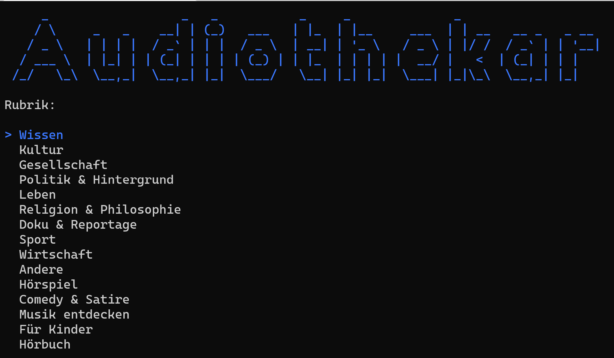

# Audiothekar
Download-Client für die ARD-Audiothek https://www.ardaudiothek.de/

Spectre-Konsolenanwendung, die die GraphQL-API abfragt und ausgewählte Programmreihen herunterlädt.

``> audiothekar-cli.exe``

